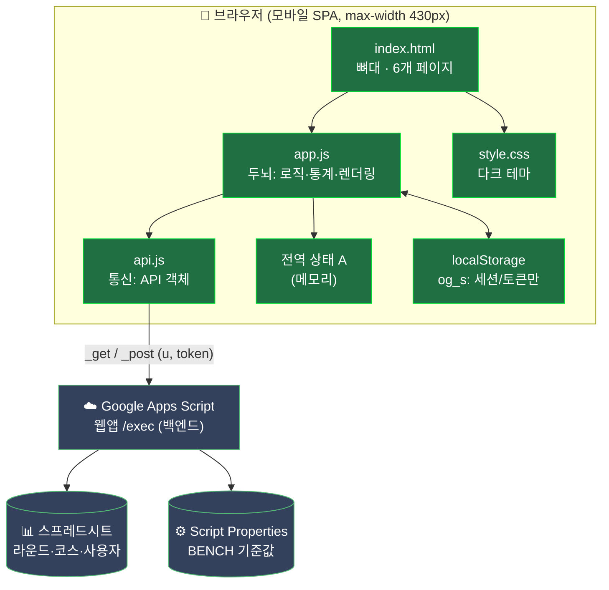
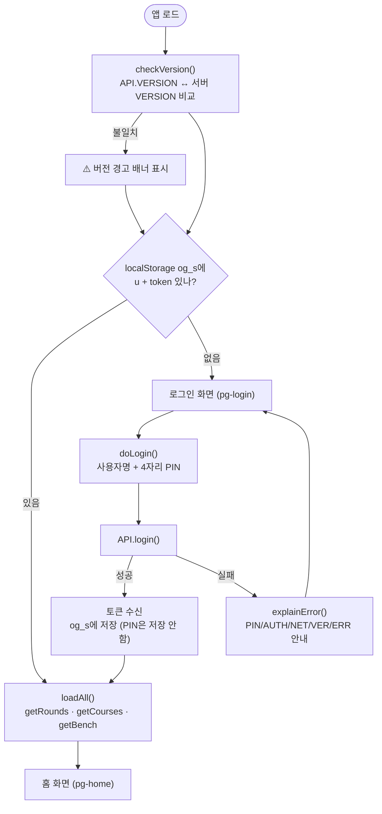
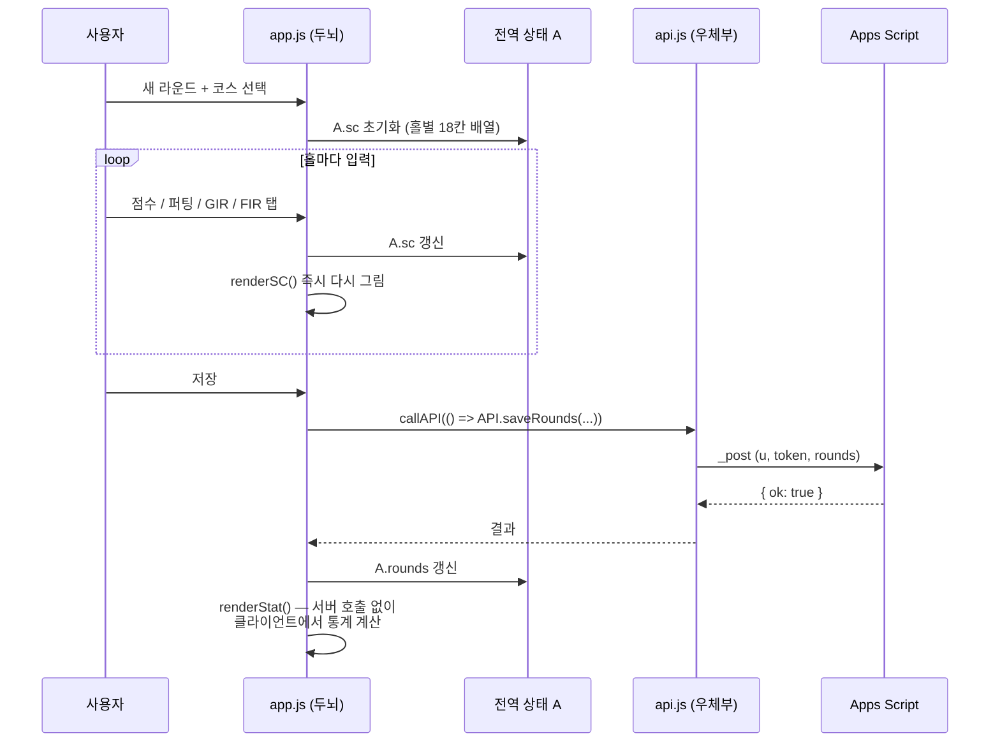
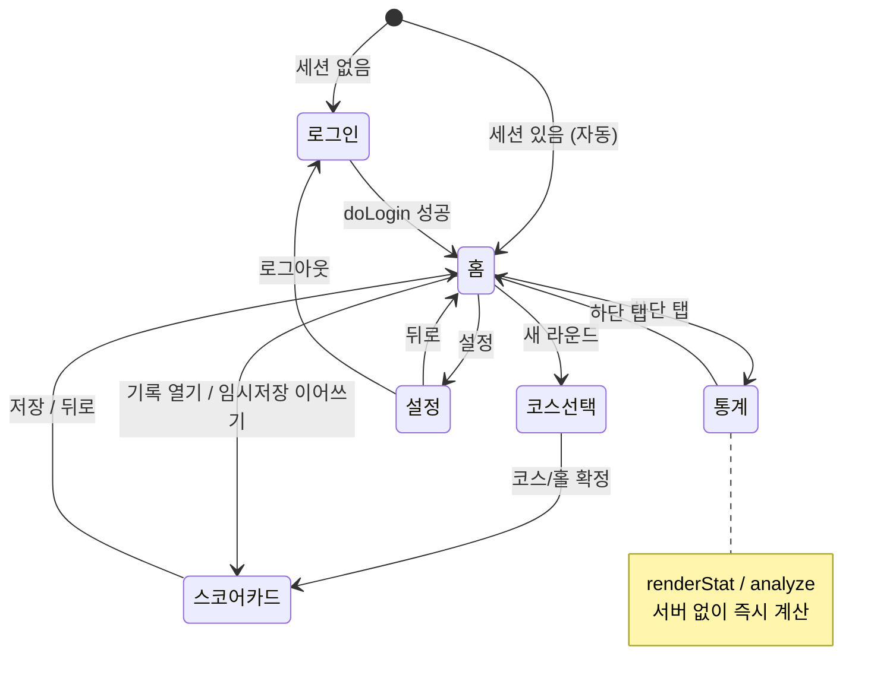

# ⛳ 온그린 (On Green)

골프 스코어카드 모바일 웹앱 — 라운드 점수를 입력하고 통계를 보는 **모바일 우선(max-width 430px) 단일 페이지 앱(SPA)**입니다.

- 버전: **v13 (2026.06.22)**
- 빌드 도구·패키지 매니저·테스트 프레임워크 **없음** — 순수 정적 프런트엔드(HTML/CSS/JS) + Google Apps Script 백엔드
- 코드·주석·UI 모두 **한국어**

---

## 빠른 시작

```bash
# 1) 저장소를 받은 폴더에서 간단한 정적 서버를 띄웁니다
#    (fetch CORS 때문에 file:// 직접 열기보다 권장)
python3 -m http.server 8000

# 2) 모바일 화면 크기로 브라우저에서 접속
#    http://localhost:8000
```

- 백엔드는 별도 배포된 **Google Apps Script 웹앱(`/exec` URL)** 과 통신합니다. 백엔드 URL은 `api.js`의 `API.URL`에 지정되어 있습니다.
- 인증: **사용자명 + 4자리 PIN → 토큰**. PIN은 저장하지 않고 토큰만 `localStorage`(`og_s` 키)에 보관합니다.

---

## 아키텍처 — "방" 비유

코드는 역할별로 파일이 명확히 분리되어 있습니다. 새 코드는 역할에 맞는 파일에만 추가하세요.

| 파일 | 별명 | 역할 |
|------|------|------|
| `index.html` | 뼈대 | 6개 페이지(`pg-login`·`pg-home`·`pg-course`·`pg-sc`·`pg-stat`·`pg-set`)의 정적 마크업과 인라인 SVG 아이콘. `api.js` → `app.js` 순서로 로드 |
| `api.js` | 통신 방 (우체부) | 서버와 주고받는 **모든** 코드. 전역 `API` 객체가 모든 엔드포인트를 노출하고, `_get`/`_post`가 인증 정보(`u`, `token`)를 자동으로 붙임 |
| `app.js` | 두뇌 방 | 로그인 판단·점수 계산·통계·화면 전환 등 모든 로직과 `render*()` 기반 UI 렌더링 |
| `style.css` | 모양 | 다크 테마, iOS 스타일. CSS 변수는 `:root`에 정의 |

### 상태 관리
- 전역 객체 **`A`**(`app.js` 상단)가 앱 전체 상태를 메모리에 보관: 사용자(`u`, `isAdm`), `rounds`, `official`(코스 목록), 현재 입력 중인 스코어카드 `A.sc`(홀별 18칸 배열).
- `localStorage`는 **세션/인증(`og_s`)만** 백업합니다. 라운드 데이터의 원본은 항상 서버입니다.
- 라운드 기록을 메모리에 들고 있으면 통계는 **서버 호출 없이 클라이언트에서 즉시 계산**됩니다(`renderStat` / `analyze`).

### BENCH (분석 기준값 / 신호등)
`BENCH` 객체는 통계 색상 판정 임계값(예: `puttGood:32`, `girGood:50`)입니다. 관리자가 설정 화면에서 수정하면 서버에 저장되어 **모든 사용자가 공유**합니다. 서버가 없거나 실패하면 `app.js`의 내장 기본값을 사용하므로 앱은 항상 동작합니다.

---

## 동작 방식 (Mermaid 다이어그램)

### 1. 전체 구조



### 2. 앱 시작 ~ 로그인 흐름



### 3. 스코어카드 입력 ~ 저장 흐름



### 4. 화면(페이지) 전환



---

## API 엔드포인트 (`api.js`)

모든 호출은 네트워크 단절을 잡는 안전 래퍼 **`callAPI(() => API.xxx())`** 형태로 감쌉니다.

| 구분 | 메서드 |
|------|--------|
| 공개 / 인증 불필요 | `ping` · `login` · `getCourses` · `getBench` |
| 인증 필요 | `getRounds` · `saveRounds` · `saveCourse` · `reportParChange` · `updatePin` · `setBench`(관리자) |
| 관리자 전용 | `getNotifications` · `clearNotifications` · `getUsers` · `deleteCourse` · `resetUserPin` · `deleteUser` |

`explainError()`는 서버 에러를 사람이 읽는 문구 + 코드(**NET / PIN / AUTH / VER / ERR**)로 변환합니다.

---

## 주의사항

- **버전 일치**: `api.js`의 `API.VERSION`은 백엔드 `Apps_Script.gs`의 `VERSION`과 **반드시 동일**해야 합니다. 불일치 시 VER 에러 / 경고 배너가 뜹니다.
- **권한 체크는 서버에서**: 관리자 전용 동작은 클라이언트가 아니라 서버(`isAdm`)에서 검증됩니다. 프런트의 표시 숨김은 편의일 뿐입니다.
- 백엔드(`Apps_Script.gs`)는 이 저장소에 없으며 Apps Script 편집기에서 따로 관리·배포합니다. 수정 후 **[배포 관리] → [새 버전]** 배포가 필요합니다(URL은 안 바뀜).
